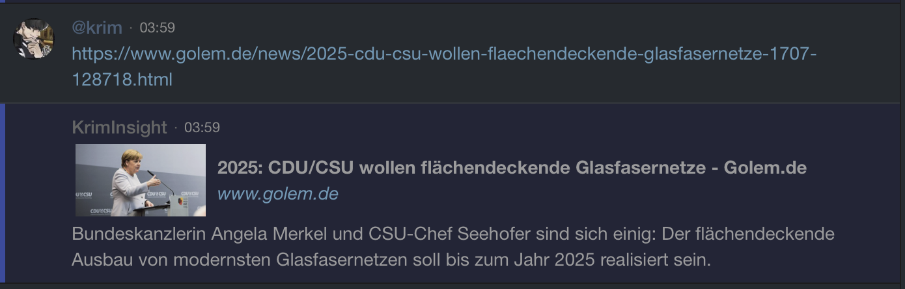

# HipChat-LinkInsight
a tiny addon, which returns the most prominent image and the description of a link inside the hipchat

## USAGE
upload to any https enabled webhost, then go to your hipchat addons page and select `Install an add-on from a descriptor URL` at the bottom left. Enter the location of the folder descriptor/ (like https://host.com/insight/descriptor/) and the webhook is ready to go.
  
  

